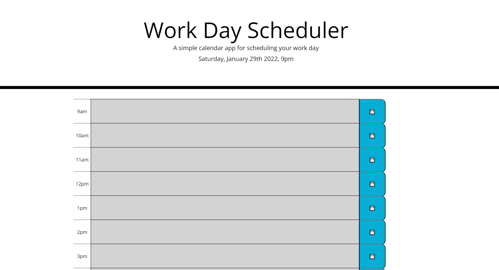
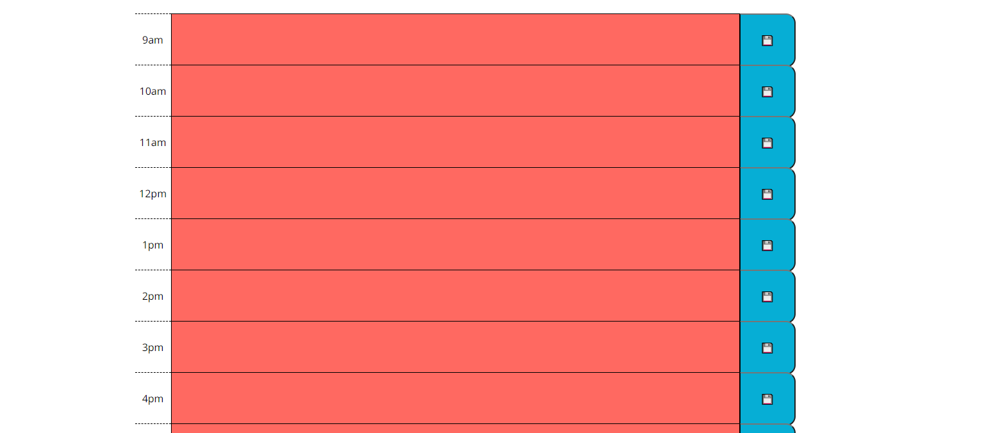
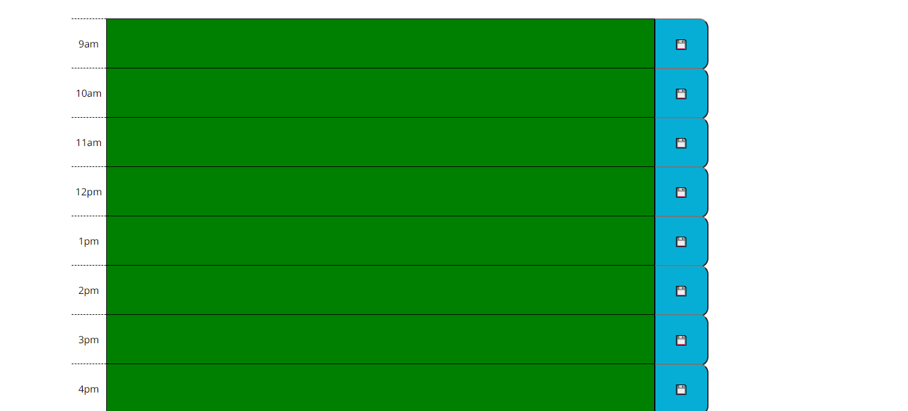

This daily planner will begin by showing you the date and time at the top of the page.

The time blocks below will change colors based upon what time it is in relation to the time of that block. Grey for past, red/orange for present, and green for future.

On the right side of each time block is a save button. Upon clicking this button the content saved in the respective time block will be saved to local storage. Thus, any data stored will populate upon page load/refresh.

https://github.com/JLewis1995/Daily-Planner

https://jlewis1995.github.io/Daily-Planner/

